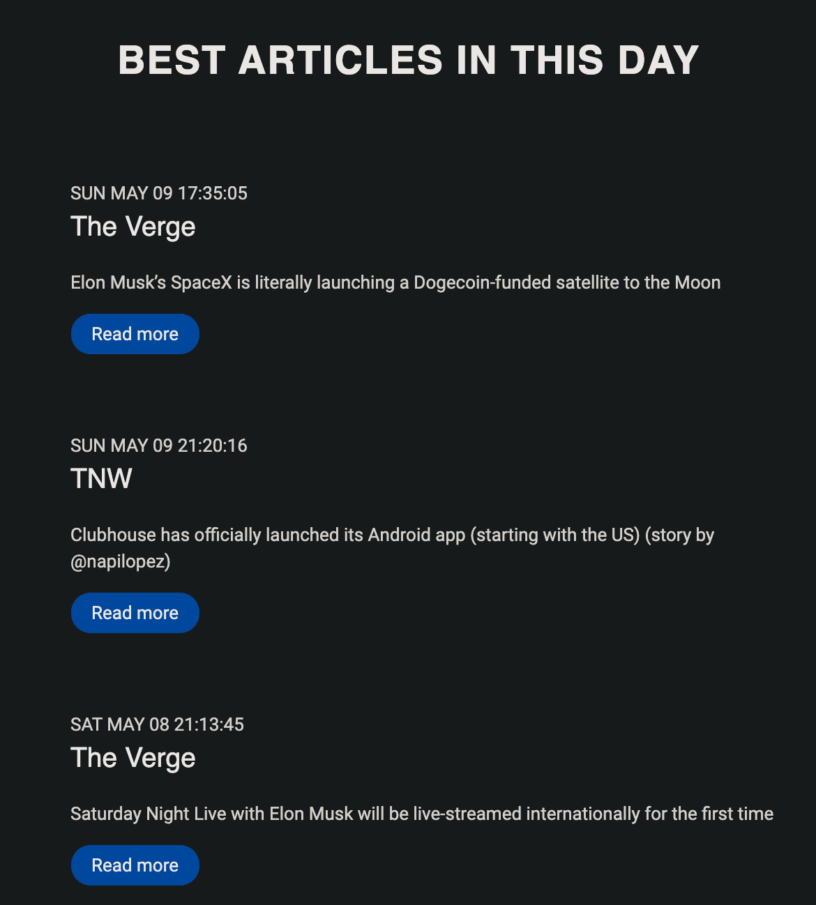

# Tweets Newsletter

Program to send relevant tweets by email. Program made for those who like to follow news on twitter but do not have time to read them all.

###### Just tech news for now.

### How to use
  - Access https://vmotta8-newsletter.netlify.app/
  - Subscribe
  - Enjoy!! 

### Example

### Technologies
  - Nodejs
  - Typescript
  - Jest
  - DynamoDB
  - Redis
  - Lambda Functions
  - Simple Email Service
  - Simple Queue Service
  - EventBridge

### Author
---
<a>
 
  
 <b>Vinicius Motta</b></a> <a>🤘</a>

